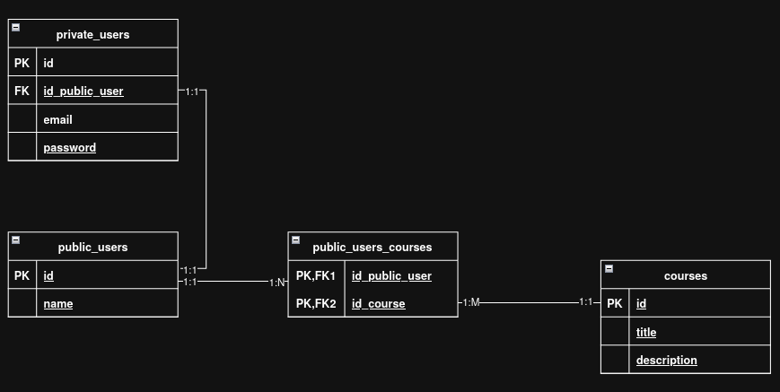

# Introducción

Este proyecto es un ejemplo explicativo de la arquitectura por capas planteada para el proyecto Knowy.

## Planteamiento

Para hacerlo lo más simple posible vamos a usar un modelo de datos muy muy simple.

Teniendo 3 entidades básicas:

-> **public_users:** el usuario público contiene datos de básicos que no comprometen la seguridad de la cuenta del
propio usuario.

-> **private_users:** contiene los datos de usuario que pueden comprometer la seguridad de la cuenta.

-> **courses:** son los cursos con su título y descripción.

Establecemos las siguientes relaciones entre tablas: 
**public_users y private_users** tienen una relación 1:1, ya que cada usuario debe tener una sola representación
privada y pública, unificando así el concepto de usuario.

**public_users y courses** están relacionados mediante una relación muchos a muchos (N:M), ya que un usuario puede estar
inscrito en varios cursos y un curso puede pertenecer a varios usuarios.  
Para representar esta relación, se crea la tabla intermedia **public_users_courses**, donde se incluyen claves
foráneas (FK) hacia ambas tablas. Estas FK actúan también como claves primarias (PK), porque la tabla representa una
entidad débil derivada de la relación N:M.

# Arquitectura por Capas

Aplicando esta arquitectura aplicaremos 4 carpetas principales: repository, service, entity, controller.

-> **Persistence (Repository):** Es la que se comunica con la base de datos y realiza las consultas.

-> **Entity:** Son las clases básicas de comunicación de la aplicación

-> **Business (Service):** Se encarga de la lógica de negocio e incluso la conexión a otros frameworks que no
relacionados con el negocio core de la aplicación.

-> **Presentation (Controller):** adapta los datos recibidos por el negocio para presentarlos en la vista de thymeleaf.

# 1. Desarrollo lista de usuarios públicos
Para empezar a realizar el desarrollo, es recomendable realizar un diagrama de flujo para entender los pasos a 
seguir en el desarrollo de la aplicación.